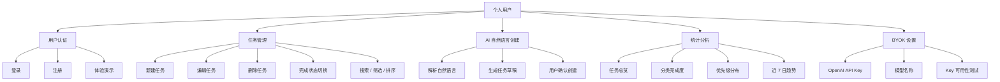
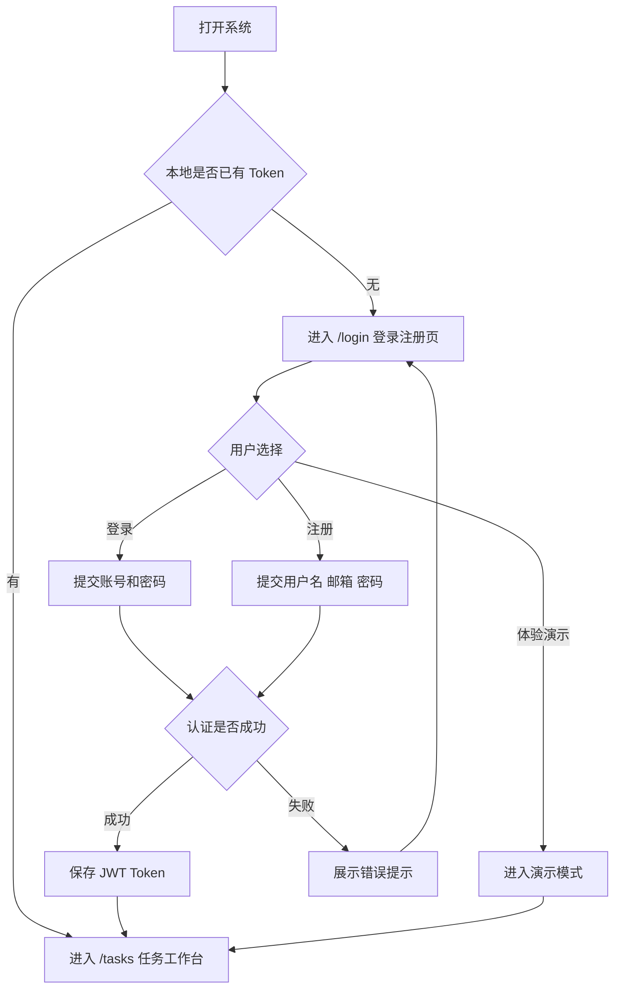
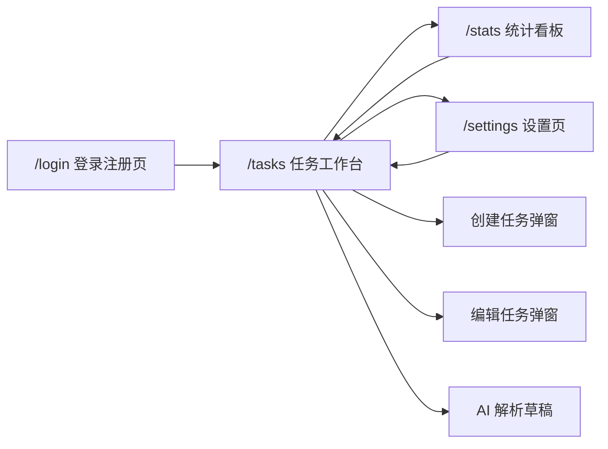
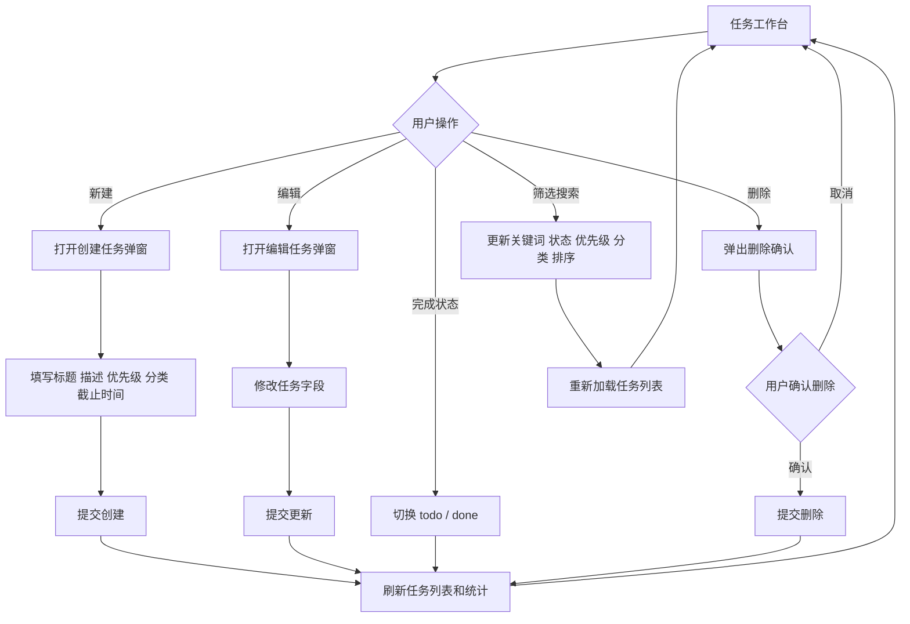
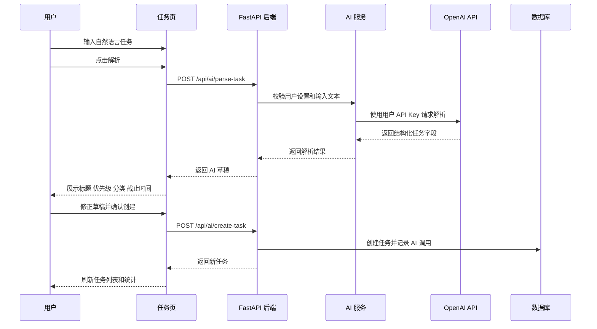
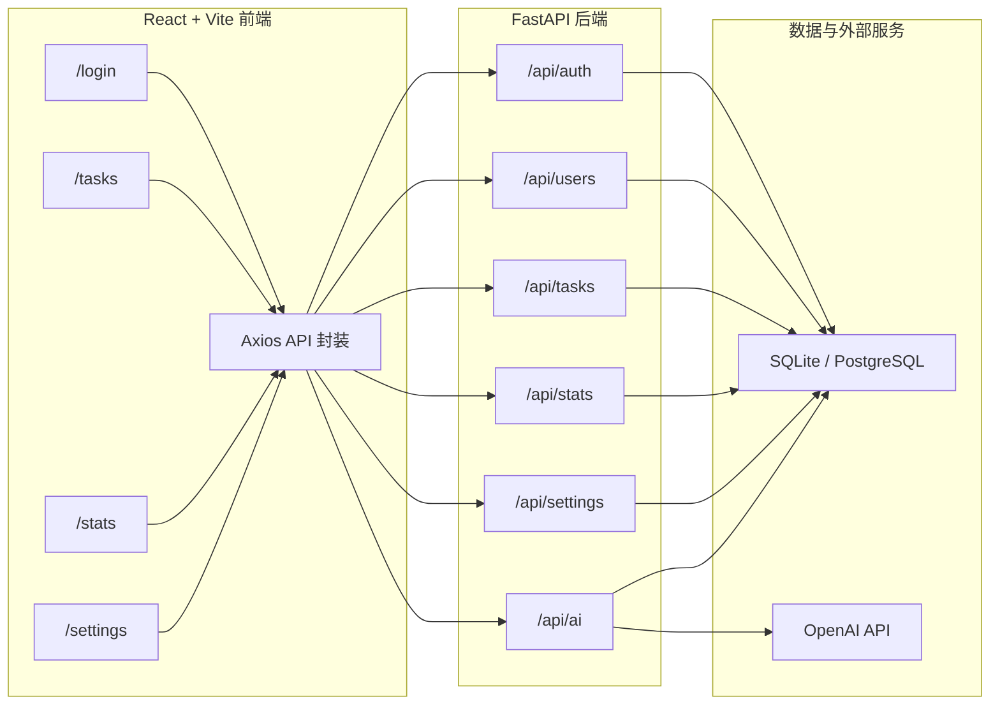
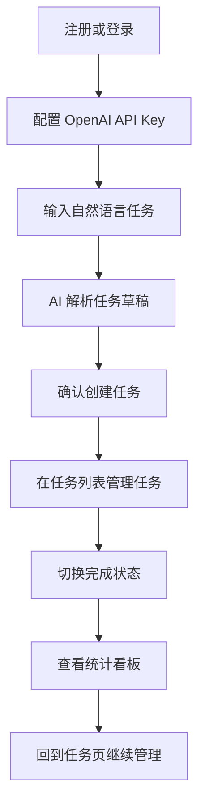

# AI-agent-TODO 功能草图

本文档以产品展示为目标，使用 Mermaid 图和页面结构说明描述 AI-agent-TODO 的系统功能、用户路径、核心流程和前后端交互关系。

## 1. 系统功能总览



## 2. 用户访问流程



## 3. 页面流转草图



### 3.1 登录注册页 `/login`

```text
+--------------------------------------------------+
| AI-agent TODO                                    |
| 把自然语言变成清晰任务                           |
|                                                  |
| [登录] [注册]                                    |
| 账号 / 邮箱输入框                                |
| 密码输入框                                       |
| [进入工作台 / 创建账号]                          |
| [体验演示]                                       |
+--------------------------------------------------+
```

展示重点：

- 支持登录和注册切换。
- 登录成功后进入任务工作台。
- 支持演示模式，便于产品展示时快速体验。

### 3.2 任务工作台 `/tasks`

```text
+--------------------------------------------------+
| 完成率          今日截止          AI 创建         |
+--------------------------------------------------+
| AI Agent 自然语言创建                            |
| [输入自然语言任务描述]                            |
| [解析] [确认创建]                                |
| AI 草稿：标题 / 优先级 / 分类 / 截止时间          |
+--------------------------------------------------+
| 搜索框 | 状态筛选 | 优先级筛选 | 分类筛选 | 新建 |
+--------------------------------------------------+
| 任务卡片：标题、描述、分类、优先级、截止时间      |
| 操作：完成 / 编辑 / 删除                         |
+--------------------------------------------------+
```

展示重点：

- 顶部展示快速统计指标。
- 中部支持 AI 自然语言创建任务。
- 下方展示任务列表、筛选条件和任务操作。

### 3.3 统计看板 `/stats`

```text
+--------------------------------------------------+
| 完成率 | 待办任务 | 今日截止 | 逾期任务          |
+--------------------------------------------------+
| 分类完成度                      | 优先级分布       |
+--------------------------------------------------+
| 近 7 日趋势：创建数量 / 完成数量                  |
+--------------------------------------------------+
```

展示重点：

- 通过指标卡展示当前任务状态。
- 通过分类和优先级图表展示任务分布。
- 通过近 7 日趋势展示任务变化。

### 3.4 设置页 `/settings`

```text
+--------------------------------------------------+
| 账号信息                                         |
| 用户名 / 邮箱 / 演示模式提示                     |
+--------------------------------------------------+
| OpenAI 配置                                      |
| 模型名称输入框                                   |
| API Key 密码输入框                               |
| 当前状态：已配置 / 未配置                        |
| [测试 Key] [保存设置]                            |
+--------------------------------------------------+
```

展示重点：

- 展示当前登录用户信息。
- 支持配置模型名称和 OpenAI API Key。
- 支持 Key 可用性测试和脱敏状态展示。

## 4. 任务管理流程



## 5. AI 自然语言创建流程



## 6. 前后端交互草图



## 7. 核心接口关系

| 页面 | 主要接口 | 用途 |
| --- | --- | --- |
| `/login` | `/api/auth/register`、`/api/auth/login` | 用户注册和登录 |
| `/tasks` | `/api/tasks`、`/api/tasks/{task_id}`、`/api/tasks/{task_id}/status` | 任务增删改查和状态切换 |
| `/tasks` | `/api/ai/parse-task`、`/api/ai/create-task` | AI 解析与 AI 创建任务 |
| `/stats` | `/api/stats/overview`、`/api/stats/category`、`/api/stats/priority`、`/api/stats/trend` | 统计看板数据 |
| `/settings` | `/api/settings`、`/api/settings/test-openai-key` | BYOK 配置和 Key 测试 |

## 8. 展示闭环



该闭环能够在产品展示中快速说明项目的核心价值：用户完成登录后，可以配置 AI 能力，通过自然语言创建任务，在任务工作台持续管理，并通过统计看板获得执行反馈。


团队成员：严骄阳、孙镇宇、上官福炜、刘明轩
日期： 2026 年 6 月
