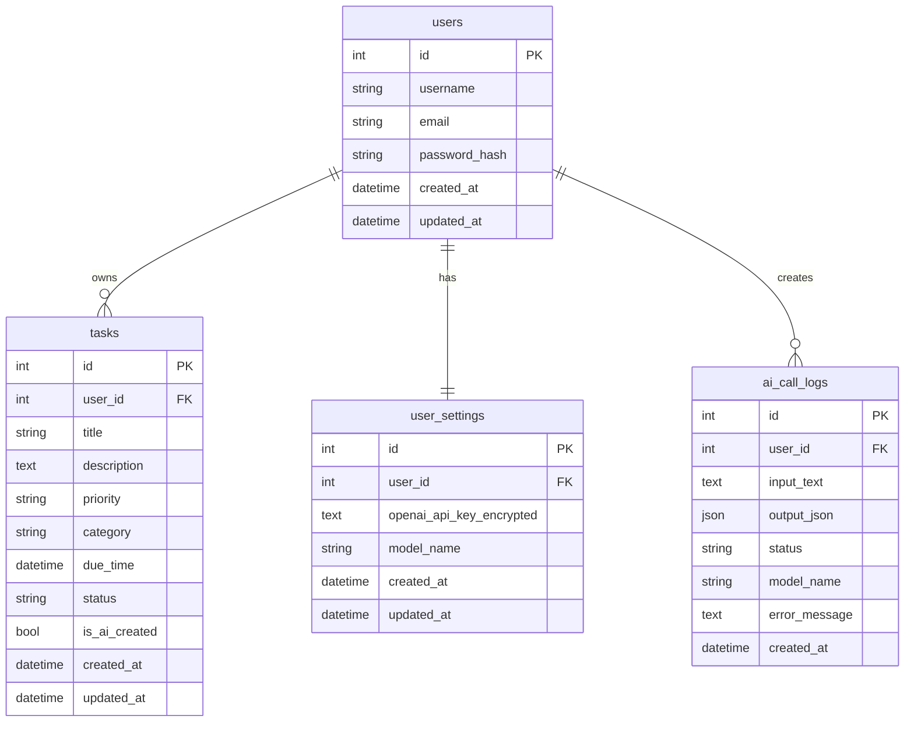

# AI-agent-TODO 后端实现文档

## 1. 文档说明

本文档基于 `doc/前后端API接口文档.md` 编写，用于指导 **AI-agent-TODO 智能任务管理系统** 后端 MVP 阶段的编码实现。

后端目标是使用 FastAPI 提供稳定的 RESTful API，支持用户认证、任务管理、AI 自然语言解析、统计分析和 BYOK 设置，并保证不同用户之间的数据隔离。

## 2. 实现范围

### 2.1 MVP 必做功能

| 模块 | 功能 |
| --- | --- |
| 用户认证 | 注册、登录、退出登录、JWT 鉴权、获取当前用户 |
| 用户信息 | 查询和更新当前用户基础信息 |
| 任务管理 | 创建、查询、更新、删除任务、切换完成状态 |
| 任务筛选 | 按状态、优先级、分类、关键词、截止时间筛选和排序 |
| AI 解析 | 自然语言解析任务、解析并创建任务、推荐分类与优先级 |
| BYOK 设置 | 保存、脱敏展示、删除、测试用户 OpenAI API Key |
| 统计分析 | 总览统计、分类统计、优先级统计、趋势统计 |
| 系统基础能力 | 统一响应、统一异常、请求日志、CORS、配置管理 |

### 2.2 MVP 暂不实现功能

- 多人协作空间。
- 团队任务分配。
- 移动端推送提醒。
- 日历双向同步。
- 多模型供应商切换。
- 复杂 RBAC 权限系统。

## 3. 技术选型

### 3.1 推荐技术栈

| 类型 | 技术 |
| --- | --- |
| Web 框架 | FastAPI |
| ASGI 服务 | Uvicorn |
| 参数校验 | Pydantic |
| ORM | SQLAlchemy |
| 数据迁移 | Alembic |
| 数据库 | SQLite 开发环境，PostgreSQL 生产环境 |
| 密码哈希 | passlib + bcrypt |
| JWT | python-jose 或 PyJWT |
| AI SDK | OpenAI Python SDK |
| 测试 | pytest + httpx |
| 配置 | pydantic-settings + `.env` |

### 3.2 Python 版本建议

建议使用 Python 3.10+。如果课程环境只能使用 Python 3.8，需要注意：

- 类型写法使用 `Optional[str]`、`List[Task]`，不要使用 `str | None`。
- 依赖版本需要固定到兼容 Python 3.8 的版本。

## 4. 后端项目结构

建议在仓库根目录下新增 `backend/` 目录。

```text
backend/
├── alembic/                         # 数据库迁移目录
├── app/
│   ├── __init__.py
│   ├── main.py                      # FastAPI 应用入口
│   ├── api/
│   │   ├── __init__.py
│   │   ├── deps.py                  # 依赖注入：DB、当前用户等
│   │   ├── router.py                # 总路由聚合
│   │   └── v1/
│   │       ├── __init__.py
│   │       ├── auth.py              # 注册、登录、退出
│   │       ├── users.py             # 当前用户信息
│   │       ├── tasks.py             # 任务管理
│   │       ├── ai.py                # AI 解析
│   │       ├── stats.py             # 统计分析
│   │       └── settings.py          # BYOK 设置
│   ├── core/
│   │   ├── __init__.py
│   │   ├── config.py                # 配置读取
│   │   ├── errors.py                # 业务异常与错误码
│   │   ├── logging.py               # 日志配置
│   │   ├── response.py              # 统一响应
│   │   └── security.py              # 密码、JWT、API Key 加解密
│   ├── db/
│   │   ├── __init__.py
│   │   ├── base.py                  # Base 和模型导入
│   │   ├── session.py               # engine、SessionLocal
│   │   └── init_db.py               # 初始化数据库
│   ├── models/
│   │   ├── __init__.py
│   │   ├── user.py
│   │   ├── task.py
│   │   ├── user_setting.py
│   │   └── ai_call_log.py
│   ├── schemas/
│   │   ├── __init__.py
│   │   ├── common.py
│   │   ├── auth.py
│   │   ├── user.py
│   │   ├── task.py
│   │   ├── ai.py
│   │   ├── stats.py
│   │   └── setting.py
│   ├── services/
│   │   ├── __init__.py
│   │   ├── auth_service.py
│   │   ├── user_service.py
│   │   ├── task_service.py
│   │   ├── ai_service.py
│   │   ├── stats_service.py
│   │   └── setting_service.py
│   ├── prompts/
│   │   └── parse_task.md            # AI 任务解析 Prompt
│   └── utils/
│       ├── __init__.py
│       ├── datetime.py              # 时间处理
│       └── mask.py                  # 脱敏工具
├── tests/
│   ├── conftest.py
│   ├── test_auth.py
│   ├── test_tasks.py
│   ├── test_ai.py
│   ├── test_stats.py
│   └── test_settings.py
├── .env.example
├── alembic.ini
├── requirements.txt
└── README.md
```

分层原则：

- `api/` 只处理 HTTP 入参、依赖注入和响应返回。
- `services/` 处理业务逻辑，不直接依赖前端概念。
- `models/` 只定义数据库模型。
- `schemas/` 只定义请求、响应和内部数据校验结构。
- `core/` 放置跨模块基础能力。

## 5. 依赖清单

`backend/requirements.txt` 建议内容：

```text
fastapi
uvicorn[standard]
sqlalchemy
alembic
pydantic
pydantic-settings
python-jose[cryptography]
passlib[bcrypt]
python-multipart
openai
httpx
pytest
pytest-asyncio
python-dotenv
cryptography
```

如果课程验收要求固定版本，可在初次跑通后执行：

```bash
pip freeze > requirements.txt
```

## 6. 环境变量设计

`backend/.env.example`：

```text
APP_NAME=AI-agent-TODO
APP_ENV=development
DEBUG=true

API_PREFIX=/api
BACKEND_CORS_ORIGINS=http://127.0.0.1:5173,http://localhost:5173

DATABASE_URL=sqlite:///./ai_agent_todo.db

JWT_SECRET_KEY=please-change-this-secret
JWT_ALGORITHM=HS256
ACCESS_TOKEN_EXPIRE_MINUTES=120

API_KEY_ENCRYPTION_SECRET=please-change-this-32-byte-secret

OPENAI_DEFAULT_MODEL=gpt-4o-mini
AI_MOCK_MODE=false
```

配置说明：

| 变量 | 说明 |
| --- | --- |
| `APP_ENV` | 当前环境，`development`、`test`、`production` |
| `DEBUG` | 是否开启调试模式 |
| `API_PREFIX` | API 路由前缀，默认 `/api` |
| `BACKEND_CORS_ORIGINS` | 允许跨域的前端地址 |
| `DATABASE_URL` | 数据库连接地址 |
| `JWT_SECRET_KEY` | JWT 签名密钥，生产环境必须替换 |
| `ACCESS_TOKEN_EXPIRE_MINUTES` | Token 有效期 |
| `API_KEY_ENCRYPTION_SECRET` | 用户 OpenAI API Key 加密密钥 |
| `OPENAI_DEFAULT_MODEL` | 默认 AI 模型 |
| `AI_MOCK_MODE` | 是否开启 AI Mock 模式 |

## 7. FastAPI 应用入口

`app/main.py` 负责创建应用、注册中间件、挂载路由和异常处理器。

实现要点：

1. 创建 `FastAPI` 实例。
2. 配置 CORS，允许前端开发地址访问。
3. 添加请求 ID 中间件。
4. 注册统一异常处理。
5. 注册 `/api` 路由。
6. 暴露健康检查接口。

示例结构：

```python
from fastapi import FastAPI
from fastapi.middleware.cors import CORSMiddleware

from app.api.router import api_router
from app.core.config import settings


def create_app() -> FastAPI:
    app = FastAPI(title=settings.APP_NAME, debug=settings.DEBUG)

    app.add_middleware(
        CORSMiddleware,
        allow_origins=settings.BACKEND_CORS_ORIGINS,
        allow_credentials=True,
        allow_methods=["*"],
        allow_headers=["*"],
    )

    app.include_router(api_router, prefix=settings.API_PREFIX)

    @app.get("/health")
    def health_check():
        return {"status": "ok"}

    return app


app = create_app()
```

本地启动：

```bash
cd backend
uvicorn app.main:app --reload --host 127.0.0.1 --port 8000
```

接口文档地址：

```text
http://127.0.0.1:8000/docs
http://127.0.0.1:8000/redoc
```

## 8. 统一响应与异常处理

### 8.1 统一响应

除 `204 No Content` 外，所有接口返回：

```json
{
  "code": 0,
  "message": "ok",
  "data": {},
  "request_id": "req_202606011500000001"
}
```

建议在 `app/core/response.py` 中实现：

```python
from typing import Any, Optional


def success(data: Any = None, message: str = "ok", request_id: Optional[str] = None) -> dict:
    payload = {
        "code": 0,
        "message": message,
        "data": data,
    }
    if request_id:
        payload["request_id"] = request_id
    return payload
```

### 8.2 业务异常

建议在 `app/core/errors.py` 中定义错误码和业务异常。

```python
class ErrorCode:
    PARAM_INVALID = 1001
    UNAUTHORIZED = 1002
    FORBIDDEN = 1003
    NOT_FOUND = 1004
    CONFLICT = 1005
    USER_EXISTS = 2001
    LOGIN_FAILED = 2002
    TASK_NOT_FOUND = 3001
    OPENAI_KEY_MISSING = 4001
    OPENAI_KEY_INVALID = 4002
    AI_PARSE_FAILED = 4003
    INTERNAL_ERROR = 5000


class BusinessError(Exception):
    def __init__(self, code: int, message: str, status_code: int = 400, data=None):
        self.code = code
        self.message = message
        self.status_code = status_code
        self.data = data
```

异常处理器返回格式：

```json
{
  "code": 3001,
  "message": "任务不存在",
  "data": null,
  "request_id": "req_202606011500000001"
}
```

### 8.3 参数校验异常

FastAPI 默认会返回 `422`，但响应结构和 API 文档不一致。建议统一转换成：

```json
{
  "code": 1001,
  "message": "参数校验失败",
  "data": {
    "errors": [
      {
        "field": "title",
        "message": "Field required"
      }
    ]
  }
}
```

## 9. 数据库设计

### 9.1 表关系



### 9.2 `users` 表

| 字段 | 类型 | 约束 | 说明 |
| --- | --- | --- | --- |
| `id` | Integer | PK, autoincrement | 用户 ID |
| `username` | String(32) | unique, not null, index | 用户名 |
| `email` | String(255) | unique, not null, index | 邮箱 |
| `password_hash` | String(255) | not null | 密码哈希 |
| `created_at` | DateTime | not null | 创建时间 |
| `updated_at` | DateTime | not null | 更新时间 |

索引建议：

- `idx_users_username`
- `idx_users_email`

### 9.3 `tasks` 表

| 字段 | 类型 | 约束 | 说明 |
| --- | --- | --- | --- |
| `id` | Integer | PK, autoincrement | 任务 ID |
| `user_id` | Integer | FK, not null, index | 所属用户 |
| `title` | String(100) | not null | 标题 |
| `description` | Text | nullable | 描述 |
| `priority` | String(16) | not null, default `medium` | 优先级 |
| `category` | String(50) | nullable, index | 分类 |
| `due_time` | DateTime | nullable, index | 截止时间 |
| `status` | String(16) | not null, default `todo`, index | 状态 |
| `is_ai_created` | Boolean | not null, default false | 是否 AI 创建 |
| `created_at` | DateTime | not null, index | 创建时间 |
| `updated_at` | DateTime | not null | 更新时间 |

复合索引建议：

- `(user_id, status)`
- `(user_id, priority)`
- `(user_id, category)`
- `(user_id, due_time)`
- `(user_id, created_at)`

### 9.4 `user_settings` 表

| 字段 | 类型 | 约束 | 说明 |
| --- | --- | --- | --- |
| `id` | Integer | PK, autoincrement | 设置 ID |
| `user_id` | Integer | FK, unique, not null | 所属用户 |
| `openai_api_key_encrypted` | Text | nullable | 加密后的 API Key |
| `model_name` | String(100) | not null | 默认模型 |
| `created_at` | DateTime | not null | 创建时间 |
| `updated_at` | DateTime | not null | 更新时间 |

说明：

- 不保存完整明文 Key。
- 如果用户删除 Key，将 `openai_api_key_encrypted` 置为 `null`。
- `model_name` 默认使用 `OPENAI_DEFAULT_MODEL`。

### 9.5 `ai_call_logs` 表

| 字段 | 类型 | 约束 | 说明 |
| --- | --- | --- | --- |
| `id` | Integer | PK, autoincrement | 日志 ID |
| `user_id` | Integer | FK, not null, index | 所属用户 |
| `input_text` | Text | not null | 用户输入 |
| `output_json` | JSON / Text | nullable | AI 输出 |
| `status` | String(16) | not null | `success`、`failed`、`mocked` |
| `model_name` | String(100) | nullable | 使用模型 |
| `error_message` | Text | nullable | 错误摘要 |
| `created_at` | DateTime | not null, index | 创建时间 |

说明：

- `output_json` 在 SQLite 中可用 Text 保存 JSON 字符串，在 PostgreSQL 中可用 JSONB。
- `error_message` 只记录错误摘要，不记录 Token、完整 API Key 等敏感信息。

## 10. SQLAlchemy 模型实现

### 10.1 通用时间字段

建议所有模型使用 UTC 时间入库。

```python
from datetime import datetime, timezone


def utc_now():
    return datetime.now(timezone.utc)
```

### 10.2 User 模型

实现要点：

- `username` 和 `email` 唯一。
- `password_hash` 不对外暴露。
- 与 `Task`、`UserSetting`、`AiCallLog` 建立关系。

```python
class User(Base):
    __tablename__ = "users"

    id = Column(Integer, primary_key=True, index=True)
    username = Column(String(32), unique=True, nullable=False, index=True)
    email = Column(String(255), unique=True, nullable=False, index=True)
    password_hash = Column(String(255), nullable=False)
    created_at = Column(DateTime(timezone=True), default=utc_now, nullable=False)
    updated_at = Column(DateTime(timezone=True), default=utc_now, onupdate=utc_now, nullable=False)
```

### 10.3 Task 模型

实现要点：

- 所有任务查询必须带 `user_id`。
- `priority`、`status` 用枚举值校验。
- `description`、`category`、`due_time` 可为空。

```python
class Task(Base):
    __tablename__ = "tasks"

    id = Column(Integer, primary_key=True, index=True)
    user_id = Column(Integer, ForeignKey("users.id"), nullable=False, index=True)
    title = Column(String(100), nullable=False)
    description = Column(Text, nullable=True)
    priority = Column(String(16), nullable=False, default="medium", index=True)
    category = Column(String(50), nullable=True, index=True)
    due_time = Column(DateTime(timezone=True), nullable=True, index=True)
    status = Column(String(16), nullable=False, default="todo", index=True)
    is_ai_created = Column(Boolean, nullable=False, default=False)
    created_at = Column(DateTime(timezone=True), default=utc_now, nullable=False, index=True)
    updated_at = Column(DateTime(timezone=True), default=utc_now, onupdate=utc_now, nullable=False)
```

## 11. Pydantic Schema 设计

### 11.1 枚举定义

```python
from enum import Enum


class Priority(str, Enum):
    low = "low"
    medium = "medium"
    high = "high"


class TaskStatus(str, Enum):
    todo = "todo"
    done = "done"


class AiStatus(str, Enum):
    success = "success"
    failed = "failed"
    mocked = "mocked"
```

### 11.2 用户 Schema

```python
class UserCreate(BaseModel):
    username: str = Field(min_length=3, max_length=32)
    email: EmailStr
    password: str = Field(min_length=8, max_length=128)


class UserLogin(BaseModel):
    account: str = Field(min_length=1)
    password: str = Field(min_length=1)


class UserRead(BaseModel):
    id: int
    username: str
    email: str
    created_at: datetime
    updated_at: datetime

    class Config:
        from_attributes = True
```

### 11.3 任务 Schema

```python
class TaskCreate(BaseModel):
    title: str = Field(min_length=1, max_length=100)
    description: Optional[str] = Field(default=None, max_length=2000)
    priority: Priority = Priority.medium
    category: Optional[str] = Field(default=None, max_length=50)
    due_time: Optional[datetime] = None


class TaskUpdate(BaseModel):
    title: Optional[str] = Field(default=None, min_length=1, max_length=100)
    description: Optional[str] = Field(default=None, max_length=2000)
    priority: Optional[Priority] = None
    category: Optional[str] = Field(default=None, max_length=50)
    due_time: Optional[datetime] = None
    status: Optional[TaskStatus] = None


class TaskStatusUpdate(BaseModel):
    status: TaskStatus
```

注意：

- `TaskUpdate` 中字段未传表示不更新。
- 前端传 `null` 时，`description`、`category`、`due_time` 应被清空。
- 如果使用 Pydantic v2，可通过 `model_fields_set` 判断字段是否真的传入。

### 11.4 AI Schema

```python
class ParseTaskRequest(BaseModel):
    text: str = Field(min_length=1, max_length=1000)
    timezone: str = "Asia/Shanghai"


class AiParsedTask(BaseModel):
    title: str
    description: Optional[str] = None
    priority: Priority = Priority.medium
    category: Optional[str] = None
    due_time: Optional[datetime] = None
    confidence: Optional[float] = Field(default=None, ge=0, le=1)
    raw_due_text: Optional[str] = None


class CreateTaskByAiRequest(ParseTaskRequest):
    overrides: Optional[dict] = None
```

## 12. 认证与安全实现

### 12.1 密码哈希

密码只能保存哈希值。

```python
from passlib.context import CryptContext

pwd_context = CryptContext(schemes=["bcrypt"], deprecated="auto")


def hash_password(password: str) -> str:
    return pwd_context.hash(password)


def verify_password(password: str, password_hash: str) -> bool:
    return pwd_context.verify(password, password_hash)
```

### 12.2 JWT 生成

Token 内容建议保持简单：

```json
{
  "sub": "1",
  "iat": 1780298400,
  "exp": 1780305600
}
```

实现要点：

- `sub` 存用户 ID。
- `exp` 使用配置中的过期时间。
- 不在 JWT 中存邮箱、用户名、权限列表等可变信息。

### 12.3 当前用户依赖

`app/api/deps.py` 中提供：

```python
def get_db():
    db = SessionLocal()
    try:
        yield db
    finally:
        db.close()


def get_current_user(
    db: Session = Depends(get_db),
    token: str = Depends(oauth2_scheme),
) -> User:
    user_id = decode_access_token(token)
    user = db.query(User).filter(User.id == user_id).first()
    if not user:
        raise BusinessError(ErrorCode.UNAUTHORIZED, "登录已过期", status_code=401)
    return user
```

所有需要登录的路由都通过 `current_user: User = Depends(get_current_user)` 获取当前用户。

### 12.4 API Key 加密与脱敏

用户 OpenAI API Key 属于敏感信息，处理要求：

- 请求进入后只在内存中短暂使用。
- 入库前加密。
- 日志不打印完整 Key。
- 响应只返回脱敏值。

脱敏规则建议：

```text
sk-****abcd
```

如果 Key 长度不足 8 位，可统一返回：

```text
****
```

加密建议使用 `cryptography.fernet.Fernet`。生产环境必须固定 `API_KEY_ENCRYPTION_SECRET`，否则重启后无法解密已有 Key。

## 13. 路由实现规划

### 13.1 路由聚合

`app/api/router.py`：

```python
from fastapi import APIRouter

from app.api.v1 import auth, users, tasks, ai, stats, settings

api_router = APIRouter()
api_router.include_router(auth.router, prefix="/auth", tags=["auth"])
api_router.include_router(users.router, prefix="/users", tags=["users"])
api_router.include_router(tasks.router, prefix="/tasks", tags=["tasks"])
api_router.include_router(ai.router, prefix="/ai", tags=["ai"])
api_router.include_router(stats.router, prefix="/stats", tags=["stats"])
api_router.include_router(settings.router, prefix="/settings", tags=["settings"])
```

### 13.2 路由顺序注意

任务模块中有静态路由和动态路由：

```text
GET /api/tasks/categories
GET /api/tasks/{task_id}
```

如果使用 FastAPI，应先注册 `/categories`，再注册 `/{task_id}`，避免 `categories` 被误匹配为 `task_id`。

## 14. 用户认证模块实现

### 14.1 `POST /api/auth/register`

处理流程：

1. 校验 `username`、`email`、`password`。
2. 查询用户名或邮箱是否已存在。
3. 使用 bcrypt 生成 `password_hash`。
4. 创建用户。
5. 创建默认用户设置 `UserSetting`。
6. 生成 JWT。
7. 返回用户信息和 Token。

关键校验：

- `username` 长度 3-32。
- `email` 格式合法。
- `password` 至少 8 位。
- 用户名和邮箱唯一。

错误处理：

| 场景 | HTTP | code |
| --- | --- | --- |
| 用户名或邮箱已存在 | `409` | `2001` |
| 参数校验失败 | `422` | `1001` |

### 14.2 `POST /api/auth/login`

处理流程：

1. 接收 `account` 和 `password`。
2. 使用 `account` 同时匹配用户名或邮箱。
3. 校验密码哈希。
4. 生成 JWT。
5. 返回用户信息和 Token。

错误处理：

- 为避免泄露账号是否存在，账号不存在和密码错误统一返回“用户名、邮箱或密码错误”。

### 14.3 `POST /api/auth/logout`

MVP 实现：

- 后端直接返回成功。
- 前端清除本地 Token。

增强实现：

- 增加 Token 黑名单表。
- 登出时记录当前 Token 的 `jti`，直到过期后清理。

### 14.4 `GET /api/users/me`

处理流程：

1. 通过 JWT 获取当前用户。
2. 返回当前用户基础信息。

注意：

- 不返回 `password_hash`。
- 不返回用户 OpenAI API Key。

### 14.5 `PUT /api/users/me`

处理流程：

1. 获取当前用户。
2. 如果修改用户名，校验唯一。
3. 如果修改邮箱，校验唯一。
4. 更新用户信息。
5. 返回最新用户信息。

## 15. 任务管理模块实现

### 15.1 数据隔离原则

所有任务查询必须包含当前用户条件：

```python
db.query(Task).filter(
    Task.id == task_id,
    Task.user_id == current_user.id,
)
```

禁止只按 `task_id` 查询后直接返回，否则会出现越权访问风险。

### 15.2 `POST /api/tasks`

处理流程：

1. 获取当前用户。
2. 校验任务字段。
3. 创建任务，`status` 默认为 `todo`，`is_ai_created` 默认为 `false`。
4. 提交数据库事务。
5. 返回任务详情。

默认值：

| 字段 | 默认值 |
| --- | --- |
| `priority` | `medium` |
| `status` | `todo` |
| `is_ai_created` | `false` |
| `description` | `null` |
| `category` | `null` |
| `due_time` | `null` |

### 15.3 `GET /api/tasks`

查询参数：

| 参数 | 处理方式 |
| --- | --- |
| `page` | 小于 1 时按参数错误处理 |
| `page_size` | 最大限制为 100 |
| `status` | 精确匹配 |
| `priority` | 精确匹配 |
| `category` | 精确匹配 |
| `keyword` | 模糊搜索标题和描述 |
| `due_from` | `due_time >= due_from` |
| `due_to` | `due_time <= due_to` |
| `sort_by` | 白名单字段 |
| `sort_order` | `asc` 或 `desc` |

排序字段白名单：

```python
SORT_FIELDS = {
    "created_at": Task.created_at,
    "updated_at": Task.updated_at,
    "due_time": Task.due_time,
    "priority": Task.priority,
}
```

分页计算：

```python
total = query.count()
items = query.offset((page - 1) * page_size).limit(page_size).all()
total_pages = math.ceil(total / page_size) if total else 0
```

注意：

- `page_size` 建议限制最大值，防止一次性拉取过多数据。
- `keyword` 为空字符串时应忽略。
- SQLite 中 `ilike` 的行为和 PostgreSQL 有差异，MVP 可接受。

### 15.4 `GET /api/tasks/{task_id}`

处理流程：

1. 根据 `task_id` 和 `current_user.id` 查询任务。
2. 如果不存在，返回 `404 / 3001`。
3. 返回任务详情。

### 15.5 `PUT /api/tasks/{task_id}`

处理流程：

1. 查询当前用户任务。
2. 根据请求体中实际传入字段更新任务。
3. 自动刷新 `updated_at`。
4. 返回更新后的任务。

注意：

- 未传字段不更新。
- 传 `null` 的可空字段要清空。
- `title` 不能为空字符串。

### 15.6 `DELETE /api/tasks/{task_id}`

MVP 使用物理删除。

处理流程：

1. 查询当前用户任务。
2. 不存在则返回 `404 / 3001`。
3. 删除并提交事务。
4. 返回 `204 No Content`。

### 15.7 `PATCH /api/tasks/{task_id}/status`

处理流程：

1. 查询当前用户任务。
2. 校验 `status` 为 `todo` 或 `done`。
3. 更新状态和 `updated_at`。
4. 返回任务 ID、状态和更新时间。

### 15.8 `GET /api/tasks/categories`

处理流程：

1. 按当前用户过滤任务。
2. 排除 `category` 为空的任务，或将空分类聚合为 `未分类`。
3. 按分类分组统计数量。
4. 返回分类列表。

SQL 思路：

```sql
SELECT category, COUNT(*) AS task_count
FROM tasks
WHERE user_id = :user_id AND category IS NOT NULL
GROUP BY category
ORDER BY task_count DESC;
```

## 16. 设置与 BYOK 模块实现

### 16.1 `GET /api/settings`

处理流程：

1. 获取当前用户。
2. 查询 `UserSetting`。
3. 如果不存在，创建默认设置。
4. 返回模型名、是否已配置 Key、脱敏 Key。

响应规则：

| 字段 | 规则 |
| --- | --- |
| `has_openai_api_key` | 加密 Key 非空时为 `true` |
| `openai_api_key_masked` | 有 Key 时返回脱敏值，无 Key 时返回 `null` |
| `model_name` | 用户设置值或默认模型 |

### 16.2 `PUT /api/settings`

处理流程：

1. 获取当前用户设置，不存在则创建。
2. 如果传入 `openai_api_key`：
   - 字符串非空：加密后保存。
   - `null`：删除已保存 Key。
3. 如果传入 `model_name`，保存模型名。
4. 返回脱敏后的设置。

注意：

- 不要在日志中打印请求体。
- 不要把完整 API Key 返回给前端。
- 如果用户只修改 `model_name`，不要覆盖已有 API Key。

### 16.3 `POST /api/settings/test-openai-key`

处理流程：

1. 如果请求体传了 `openai_api_key`，测试该 Key。
2. 如果未传，读取当前用户已保存 Key 并解密。
3. 如果没有可用 Key，返回 `400 / 4001`。
4. 使用指定模型发起一次轻量调用。
5. 返回 `valid` 和耗时。

测试调用建议：

- Prompt 使用非常短的文本，例如 `ping`。
- 设置较短超时时间，例如 10 秒。
- 捕获认证失败、模型无权限、网络错误。

错误映射：

| 场景 | HTTP | code |
| --- | --- | --- |
| 未配置 Key | `400` | `4001` |
| Key 无效或模型无权限 | `401` | `4002` |
| OpenAI 服务异常 | `500` | `4003` |

## 17. AI 模块实现

### 17.1 AI 服务职责

`app/services/ai_service.py` 负责：

- 读取用户 OpenAI API Key。
- 调用 OpenAI API。
- 解析和校验 JSON 输出。
- 失败时返回明确错误或 Mock 兜底结果。
- 记录 AI 调用日志。

路由层不直接调用 OpenAI SDK。

### 17.2 Prompt 设计

`app/prompts/parse_task.md` 建议内容：

```text
你是一个任务管理助手。请从用户输入中提取待办任务信息，并只返回 JSON。

当前用户时区：{timezone}
当前时间：{now}

要求：
1. title 必须是简洁任务标题。
2. priority 只能是 low、medium、high。
3. category 使用简短中文分类，例如 学习、工作、生活、项目。
4. due_time 必须是 ISO 8601 时间字符串；无法解析则返回 null。
5. 不要返回 Markdown，不要返回解释。

返回 JSON Schema：
{
  "title": "string",
  "description": "string or null",
  "priority": "low | medium | high",
  "category": "string or null",
  "due_time": "ISO 8601 string or null",
  "confidence": 0.0,
  "raw_due_text": "string or null"
}

用户输入：
{text}
```

### 17.3 `POST /api/ai/parse-task`

处理流程：

1. 获取当前用户。
2. 查询并解密用户 OpenAI API Key。
3. 如果未配置 Key：
   - `AI_MOCK_MODE=false`：返回 `400 / 4001`。
   - `AI_MOCK_MODE=true`：返回 Mock 结果，`ai_status=mocked`。
4. 调用 OpenAI API。
5. 从模型输出中解析 JSON。
6. 用 `AiParsedTask` Schema 校验字段。
7. 应用兜底规则。
8. 写入 `AiCallLog`。
9. 返回解析结果。

兜底规则：

| 字段 | 兜底 |
| --- | --- |
| `title` | 原始输入前 100 字 |
| `description` | `null` |
| `priority` | `medium` |
| `category` | `null` 或 `未分类` |
| `due_time` | `null` |
| `confidence` | `null` |
| `raw_due_text` | 原始时间表达或 `null` |

### 17.4 `POST /api/ai/create-task`

处理流程：

1. 复用 `parse_task` 逻辑得到 `parsed_task`。
2. 合并 `overrides`。
3. 使用合并后的字段创建任务。
4. `is_ai_created=true`。
5. 返回任务和原始解析结果。

字段合并优先级：

```text
overrides > AI parsed result > 系统默认值
```

注意：

- `overrides` 也必须经过任务字段校验。
- 创建任务和记录 AI 日志建议在同一个业务流程中完成，但不要求同一个数据库事务。

### 17.5 `POST /api/ai/suggest`

处理流程：

1. 接收普通任务标题和描述。
2. 调用 AI 推荐 `priority` 和 `category`。
3. 校验推荐值。
4. 返回推荐结果和简短原因。

失败兜底：

- AI 调用失败时可返回 `priority=medium`、`category=null`，并设置 `ai_status=mocked` 或返回业务错误。
- MVP 建议前端把该能力作为辅助按钮，不阻塞普通任务创建。

### 17.6 `GET /api/ai/logs`

处理流程：

1. 按当前用户过滤日志。
2. 支持按 `status` 筛选。
3. 分页返回。

安全要求：

- 不返回 API Key。
- 不返回底层 SDK 的完整异常堆栈。
- `error_message` 只展示可理解的摘要。

## 18. 统计模块实现

### 18.1 统计时间范围

统计接口支持 `from` 和 `to` 参数时，应按任务 `created_at` 过滤。

```python
if from_time:
    query = query.filter(Task.created_at >= from_time)
if to_time:
    query = query.filter(Task.created_at <= to_time)
```

如果产品后续希望按 `due_time` 或完成时间统计，需要新增字段 `completed_at`，MVP 暂不要求。

### 18.2 `GET /api/stats/overview`

统计字段：

| 字段 | 计算方式 |
| --- | --- |
| `total_tasks` | 当前用户任务总数 |
| `done_tasks` | `status = done` |
| `todo_tasks` | `status = todo` |
| `completion_rate` | `done_tasks / total_tasks`，无任务时为 0 |
| `overdue_tasks` | `status = todo` 且 `due_time < now` |
| `today_due_tasks` | `due_time` 在今天 00:00-23:59 |
| `ai_created_tasks` | `is_ai_created = true` |

### 18.3 `GET /api/stats/category`

处理流程：

1. 按当前用户过滤任务。
2. 按 `category` 分组。
3. 统计每组 `total`、`done`、`todo`。
4. 计算 `completion_rate`。

未分类处理：

```text
category 为空或空字符串 -> 未分类
```

### 18.4 `GET /api/stats/priority`

处理流程：

1. 按当前用户过滤任务。
2. 按 `priority` 分组。
3. 返回 `high`、`medium`、`low` 三组。

建议即使某个优先级数量为 0，也返回该优先级，方便前端图表稳定渲染。

### 18.5 `GET /api/stats/trend`

处理流程：

1. 接收 `days`，默认 7。
2. 限制最大值，例如 30。
3. 计算最近 N 天每天创建任务数。
4. 计算每天完成任务数。

注意：

- MVP 没有 `completed_at` 字段时，只能用 `updated_at` 近似统计完成任务日期。
- 如果需要准确统计完成趋势，建议给 `tasks` 表增加 `completed_at` 字段。
- 第一阶段可在文档中说明该统计为近似值。

## 19. 服务层设计

### 19.1 AuthService

主要方法：

| 方法 | 说明 |
| --- | --- |
| `register(db, payload)` | 注册用户并返回 Token |
| `login(db, payload)` | 登录并返回 Token |
| `create_access_token(user)` | 生成访问 Token |

### 19.2 TaskService

主要方法：

| 方法 | 说明 |
| --- | --- |
| `create_task(db, user_id, payload, is_ai_created=False)` | 创建任务 |
| `list_tasks(db, user_id, filters)` | 查询任务列表 |
| `get_task(db, user_id, task_id)` | 获取任务详情 |
| `update_task(db, user_id, task_id, payload)` | 更新任务 |
| `delete_task(db, user_id, task_id)` | 删除任务 |
| `update_status(db, user_id, task_id, status)` | 更新任务状态 |
| `list_categories(db, user_id)` | 查询分类列表 |

### 19.3 SettingService

主要方法：

| 方法 | 说明 |
| --- | --- |
| `get_or_create_setting(db, user_id)` | 获取或创建设置 |
| `update_setting(db, user_id, payload)` | 更新设置 |
| `get_openai_key(db, user_id)` | 解密并返回 Key |
| `test_openai_key(api_key, model_name)` | 测试 Key 可用性 |

### 19.4 AiService

主要方法：

| 方法 | 说明 |
| --- | --- |
| `parse_task(db, user_id, text, timezone)` | 解析自然语言任务 |
| `create_task_from_text(db, user_id, payload)` | 解析并创建任务 |
| `suggest(db, user_id, title, description)` | 推荐分类和优先级 |
| `write_log(db, user_id, input_text, output_json, status, model_name, error_message)` | 记录日志 |

### 19.5 StatsService

主要方法：

| 方法 | 说明 |
| --- | --- |
| `overview(db, user_id, from_time, to_time)` | 统计总览 |
| `by_category(db, user_id, from_time, to_time)` | 分类统计 |
| `by_priority(db, user_id)` | 优先级统计 |
| `trend(db, user_id, days)` | 趋势统计 |

## 20. 数据库迁移流程

### 20.1 初始化 Alembic

```bash
cd backend
alembic init alembic
```

### 20.2 配置模型元数据

在 `alembic/env.py` 中引入：

```python
from app.db.base import Base

target_metadata = Base.metadata
```

### 20.3 生成迁移

```bash
alembic revision --autogenerate -m "init tables"
```

### 20.4 执行迁移

```bash
alembic upgrade head
```

### 20.5 开发阶段 SQLite 简化方案

如果课程时间紧，可先在启动时使用：

```python
Base.metadata.create_all(bind=engine)
```

但建议最终保留 Alembic 迁移脚本，便于验收和部署。

## 21. 测试方案

### 21.1 测试数据库

测试环境使用独立 SQLite 文件或内存数据库：

```text
sqlite:///./test_ai_agent_todo.db
```

测试前创建表，测试后清理数据。

### 21.2 必测用例

认证模块：

- 注册成功。
- 重复邮箱注册失败。
- 登录成功。
- 密码错误登录失败。
- 未登录访问 `/api/users/me` 返回 401。

任务模块：

- 创建任务成功。
- 查询任务列表只返回当前用户任务。
- 更新任务成功。
- 删除任务成功。
- 用户 A 不能访问用户 B 的任务。
- 筛选状态、优先级、分类、关键词成功。

AI 模块：

- 未配置 Key 时返回 `4001`。
- Mock 模式下可返回解析结果。
- AI 返回非法 JSON 时能兜底或返回 `4003`。
- 解析并创建任务后 `is_ai_created=true`。

设置模块：

- 获取默认设置。
- 保存 Key 后返回脱敏值。
- 删除 Key 后 `has_openai_api_key=false`。
- 测试无 Key 返回 `4001`。

统计模块：

- 空任务时完成率为 0。
- 创建多个任务后统计数量正确。
- 分类统计包含未分类。
- 优先级统计三种优先级都返回。

### 21.3 接口测试命令

```bash
cd backend
pytest
```

建议在 CI 或提交前运行：

```bash
pytest -q
```

## 22. 本地开发流程

### 22.1 创建虚拟环境

```bash
cd backend
python -m venv .venv
source .venv/bin/activate
```

Windows：

```bash
.venv\Scripts\activate
```

### 22.2 安装依赖

```bash
pip install -r requirements.txt
```

### 22.3 配置环境变量

```bash
cp .env.example .env
```

修改 `.env` 中的密钥配置。

### 22.4 初始化数据库

```bash
alembic upgrade head
```

### 22.5 启动服务

```bash
uvicorn app.main:app --reload --host 127.0.0.1 --port 8000
```

### 22.6 联调检查

启动后访问：

```text
http://127.0.0.1:8000/health
http://127.0.0.1:8000/docs
```

## 23. 前后端联调注意事项

### 23.1 CORS

前端 Vite 默认地址通常为：

```text
http://127.0.0.1:5173
http://localhost:5173
```

后端必须将这些地址加入 `BACKEND_CORS_ORIGINS`。

### 23.2 Token

前端请求头：

```http
Authorization: Bearer <access_token>
```

后端需要兼容大小写标准，但不需要支持自定义 Token Header。

### 23.3 时间

前端传入：

```json
{
  "due_time": "2026-06-02T18:00:00+08:00"
}
```

后端处理：

1. Pydantic 解析为 `datetime`。
2. 入库前转换为 UTC。
3. 返回时可以返回带时区的 ISO 字符串。

### 23.4 删除接口

`DELETE /api/tasks/{task_id}` 成功时返回 `204`，无响应体。前端不要按统一响应结构解析该接口。

### 23.5 AI 解析确认流程

推荐前端流程：

1. 用户输入自然语言。
2. 调用 `/api/ai/parse-task`。
3. 前端展示可编辑确认表单。
4. 用户确认后调用 `/api/tasks` 创建任务。

如果做一键创建，再调用 `/api/ai/create-task`。

## 24. 安全与隐私要求

### 24.1 必须避免的问题

- 明文保存用户密码。
- 明文保存或打印 OpenAI API Key。
- 日志中打印 JWT。
- 只通过 `task_id` 查询任务导致越权访问。
- 把数据库异常堆栈直接返回给前端。

### 24.2 推荐安全措施

- 密码使用 bcrypt。
- API Key 加密保存。
- JWT 密钥使用随机强密钥。
- 所有用户资源查询都带 `user_id`。
- 生产环境关闭 `DEBUG`。
- 限制 `page_size` 和 AI 输入长度。
- 对登录和 AI 调用接口做基础频率限制。

## 25. 日志设计

### 25.1 普通请求日志

建议记录：

- 请求 ID。
- HTTP 方法。
- 路径。
- 状态码。
- 耗时。
- 当前用户 ID，如果已登录。

禁止记录：

- 明文密码。
- 完整 Token。
- 完整 OpenAI API Key。

### 25.2 AI 调用日志

保存到 `ai_call_logs` 表：

- 用户输入。
- 结构化输出。
- 调用状态。
- 模型名称。
- 错误摘要。
- 创建时间。

如果担心用户输入包含隐私，可后续增加用户开关，允许关闭 AI 日志保存。

## 26. 开发优先级建议

### 第 1 步：基础工程

- 创建 `backend/` 目录。
- 配置 FastAPI、SQLAlchemy、Pydantic。
- 实现配置、数据库连接、统一响应和异常处理。
- 启动 `/health` 和 Swagger。

### 第 2 步：认证与用户

- 实现 `User` 模型。
- 实现注册、登录、JWT。
- 实现 `get_current_user`。
- 实现 `/api/users/me`。

### 第 3 步：任务 CRUD

- 实现 `Task` 模型。
- 实现任务创建、列表、详情、更新、删除、状态切换。
- 补充用户数据隔离测试。

### 第 4 步：设置与 BYOK

- 实现 `UserSetting`。
- 实现 Key 加密、脱敏、删除。
- 实现 Key 测试接口。

### 第 5 步：AI 能力

- 先实现 Mock 模式。
- 再接入 OpenAI API。
- 实现 AI 日志。
- 实现解析、创建、推荐接口。

### 第 6 步：统计接口

- 实现总览、分类、优先级和趋势统计。
- 用测试数据校验统计结果。

### 第 7 步：联调和验收

- 对照 `doc/前后端API接口文档.md` 检查字段。
- 用 Swagger 或 Postman 跑通核心流程。
- 配合前端完成登录、任务、AI、统计页面联调。

## 27. 验收检查清单

后端提交前应确认：

- `uvicorn app.main:app --reload` 可以正常启动。
- `/health` 返回正常。
- `/docs` 可以查看全部接口。
- 注册、登录、获取当前用户流程跑通。
- 任务 CRUD 和状态切换跑通。
- 用户之间无法访问彼此任务。
- 设置接口不会返回完整 OpenAI API Key。
- 未配置 Key 时 AI 接口返回明确错误。
- Mock 模式下 AI 流程可演示。
- 统计接口在空数据和有数据时都正常。
- `pytest` 通过。
- README 或后端 README 中包含启动说明。

## 28. 与 API 文档的一致性要求

后端实现完成后，需要逐项核对 `doc/前后端API接口文档.md`：

| 检查项 | 要求 |
| --- | --- |
| 路径 | 与 API 文档一致，统一使用 `/api` 前缀 |
| 方法 | GET、POST、PUT、PATCH、DELETE 与文档一致 |
| 认证 | 除注册、登录外均要求 JWT |
| 响应结构 | 除 204 外均返回 `code`、`message`、`data` |
| 错误码 | 使用文档中定义的业务错误码 |
| 时间格式 | 返回 ISO 8601 字符串 |
| 枚举值 | `priority`、`status`、`ai_status` 不新增临时值 |
| 数据隔离 | 所有用户资源按 `current_user.id` 过滤 |

如需变更接口字段，应先更新 API 文档，再修改前后端代码。

## 29. 版本变更记录

| 版本 | 日期 | 说明 |
| --- | --- | --- |
| v0.1 | 2026-05-31 | 初始化后端实现文档 |
